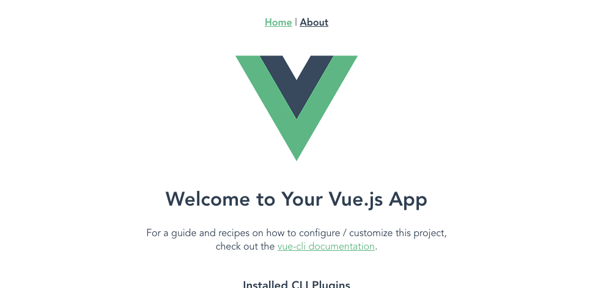
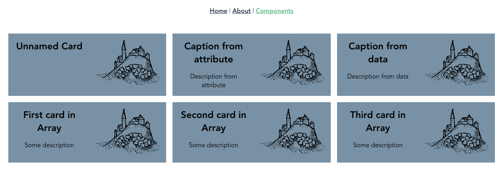

# Vue3 First Steps Project
November 10, 2020

Создал тестовый проект Vue 3
и записал последовательность действий.

#### Published Result:
https://zlsheepcity.github.io/vue3-first-steps/dist/#/Components

## Step 1. Create default project with Vue CLI

Official documentation:
https://cli.vuejs.org/guide/

```
npm install -g @vue/cli
vue create hello-world
```

При создании спрашиваются опции.
Мой выбор для быстрого старта:

```
» Manually

» Choose Vue version
» Router
» Vuex

» Vue 3 (Preview)

» History mode → No

» Config in package.json
```

После успешного завершения можно посмотреть как работает сайт «из коробки».

```
cd hello-world
npm run serve
```



Внутри можно найти две тестовые страницы Home/About (в местной терминологии это views) и тестовый компонент с описанием фреймворка.

Создание новой страницы и нового компонента — хорошее начало для самостоятельной работы.


## Step 2. Make Build

```
npm run build
```

Команда сгенерирует сайт в папку dist. После первой попытки я создал дополнительный конфигурационный файл. С этим файлом сгенерированный сайт из папки dist можно открывать локально в браузере (и публиковать на гитхабе без ошибок).

https://github.com/zlsheepcity/vue3-first-steps/blob/main/vue.config.js


## Step 3. Create custom component and view

### 3.1 Component

Для эксперимента хочу сделать компонент «карточка», состоящий из заголовка, описания и иконки.

Заголовок и описание компонент будет получает извне — через аттрибуты в хтмл теге (vue props). Иконка просто для красоты.

Создал файл компонента `src/components/SimpleCard.vue`:

https://github.com/zlsheepcity/vue3-first-steps/blob/main/src/components/SimpleCard.vue

### 3.2 View

Создал новую страницу `src/views/Components.vue`, где использую компонент. На странице четыре варианта использования:

https://github.com/zlsheepcity/vue3-first-steps/blob/main/src/views/Components.vue

#### Комментарий к коду

Не удержался и разделил яваскрипт на три части `define export` / `main logic` / `export ready`. Это моя собственная выдумка, помогало избавиться от бардака в коде фреймворка.

### 3.3 Router

Созданную страницу надо описать в роутере, который подключил во время инсталяции. По факту это новая запись в массиве routes, по примеру уже существующих (снова моё форматирование отличается от стандартов):

https://github.com/zlsheepcity/vue3-first-steps/blob/main/src/router/index.js#L21

Добавил ссылку «Components» в меню сайта:

https://github.com/zlsheepcity/vue3-first-steps/blob/main/src/App.vue#L5

### Result


